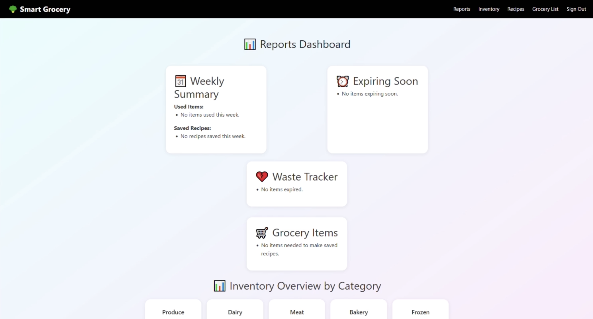
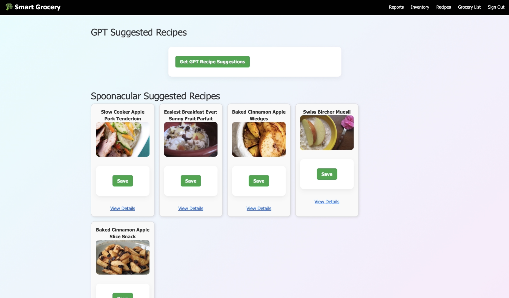

# Smart Grocery Housekeeping App
<p align="left">
  
  
  
  
  
</p>

This is a web-based application designed for the **CS467 Capstone Project** at Oregon State University. The goal is to explore the **maximum possible use of AI tools** while developing a functional app that reduces household food waste through intelligent grocery tracking and recipe suggestions.

---


## Project Overview
In today’s fast-paced world, groceries often go unused and spoil. Our app helps users:
- Record groceries via manual entry, barcode scanning, or image recognition
- Get notified about items nearing expiration
- Receive recipe suggestions based on current pantry inventory
- Track frequently used, spoiled, or unused items
We built this app while documenting the entire process of using AI tools such as ChatGPT, GitHub Copilot, Google Teachable Machine, and more.

---
## 📸 Screenshots


<p align="center">
  
</p>

<p align="center">
  
</p>

<p align="center">
  
</p>

---
##  Demo Video

Check out a walkthrough of the Smart Grocery Housekeeping App:

<p align="center">
  <a href="https://www.youtube.com/watch?v=iTaJFPtDD4w">
    
  </a>
</p>
___

## My Contributions

As part of this project, my work focused on building the app’s **AI-driven features** and integrating them into a production-ready Flask backend.

### Image Recognition System
I designed and implemented the app’s grocery recognition pipeline, including:
- Training a custom classifier with **webcam photos**, **Fruits-360 dataset images**, and **AI-generated images**  
- Exporting the trained model to **TensorFlow.js** and integrating it into the browser  
- Implementing:
  - Real-time webcam classification  
  - Image upload prediction  
  - Mode switching (webcam ↔ upload)  
  - A correction flow for users to fix misclassified items  

### GPT-Powered Recipe Suggestions
I developed the backend module powering GPT recipe generation, including:
- Creating the **`gpt_helpers.py`** module  
- Implementing the **`/recipes/suggestions`** Flask route  
- Designing structured prompts for consistent, useful recipe output  
- Adding token-based access and **mocked GPT responses** to enable testing  
- Documenting the module for development and integration with UI pages  

### AI-Assisted Engineering Workflow
Throughout the project, I led experimentation with AI tools such as ChatGPT and Teachable Machine by:
- Rapid-prototyping new features through iterative prompt tuning  
- Using AI to debug, design interfaces, and refine backend logic  
- Evaluating where AI accelerated development versus where careful human oversight was required  
---

## Features

- **Grocery Recognition**: Upload or capture images to identify grocery items using a trained TensorFlow model.
- **Recipe Suggestions**: Suggests recipes based on inventory using GPT and Spoonacular API.
- **Inventory Tracking**: Manually or automatically update item status (used/spoiled).
- **Reports**: Usage insights, spoilage tracking, and frequently used item reports.
- **User Auth**: Secure login system with Flask-Login & JWT support.
- **Responsive UI**: Template-driven Flask frontend with support for multiple pages.

---

## Technologies Used

- **Backend**: Python, Flask, SQLAlchemy
- **Frontend**: HTML, Jinja2, CSS, JS
- **Database**: SQLite / MySQL
- **Authentication**: Flask-Login, JWT
- **AI Tools**: OpenAI GPT API, TensorFlow.js (Teachable Machine)
- **APIs**: Spoonacular, Open Food Facts
- **DevOps**: GitHub Actions CI, `.env` config handling

---

## Setup Instructions

1. **Clone the repository**:
    ```bash
    git clone https://github.com/TDePalatis/Smart-Grocery-App.git
    cd Smart-Grocery-App
    ```

2. **Install dependencies**:
    ```bash
    python3 -m venv venv
    source venv/bin/activate
    pip install -r requirements.txt
    ```

3. **Environment Setup**:
    Create a `.env` file (see `.env.example`):
    ```
    FLASK_ENV=development
    SECRET_KEY=your-secret
    JWT_SECRET_KEY=your-jwt-secret
    DATABASE_URL=sqlite:///instance/dev.db
    ```

4. **Run the app**:
    ```bash
    python run.py
    ```

---

## Deployment Notes

Supports deployment via:
- Local: Development config with SQLite
- Production: MySQL setup with environment configuration
- Compatible with Google Cloud / Firebase for hosting

---

## Test Automation (PyTest)

This project includes a suite of automated tests using PyTest and a custom testing configuration.

### Features tested:
- User registration flow
- Duplicate email handling
- Login success and failure
- Protected route access (requires login)

### Run Tests
```bash
python -m venv .venv && source .venv/bin/activate     # Windows: .\.venv\Scripts\activate
pip install -r requirements.txt pytest
PYTHONPATH=. python -m pytest -q SmartGroceryApp/tests
```

Or simply:

```bash
pytest
```


---

## Project Structure


```
Smart-Grocery-App/
  ├── SmartGroceryApp/      # Flask application package
  ├── tests/                # PyTest test suite
  ├── run.py                # App entrypoint
  ├── requirements.txt      # Python dependencies
  └── README.md
```

```
SmartGroceryApp/
├── auth/           # Login & register routes
├── grocery_list/   # Smart grocery list views
├── inventory/      # Item tracking & management
├── recipes/        # GPT and API-powered recipes
├── reports/        # Usage data visualization
├── utils/          # GPT helper functions
├── validators/     # JSON schema validation
├── static/         # CSS and model files
├── templates/      # Shared and modular Jinja2 templates
|-- tests           # Test Automation
├── models.py       # SQLAlchemy models
├── config.py       # App configuration by env
└── extensions.py   # Initialized extensions
```

---

##� Reports

Includes usage and spoilage analytics rendered with Flask and Jinja2.

---

## License

Apache 2.0 License – see [`LICENSE.txt`](./LICENSE.txt)

---

## Authors
Trevor DePalatis, Sayid Ali, Nathan Schuler – Spring 2025

