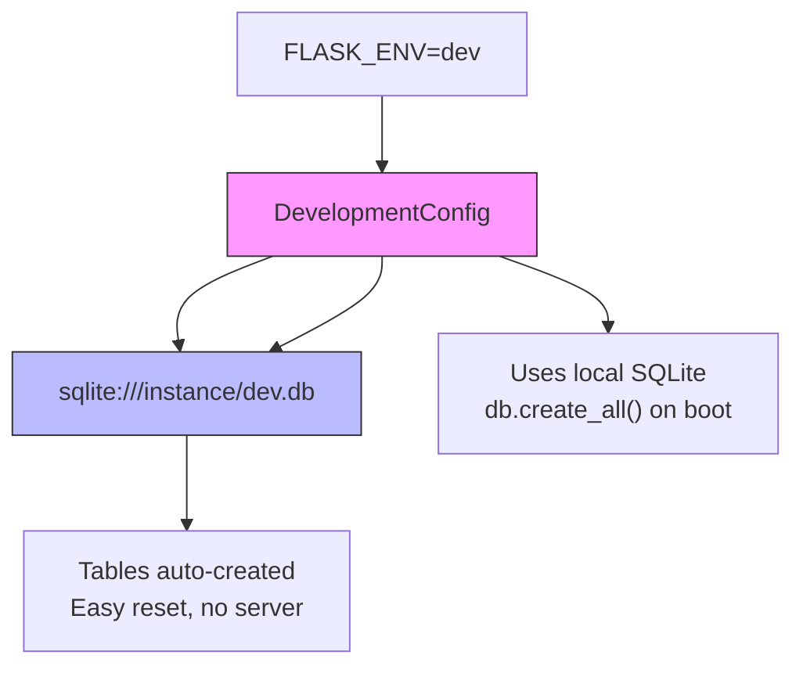
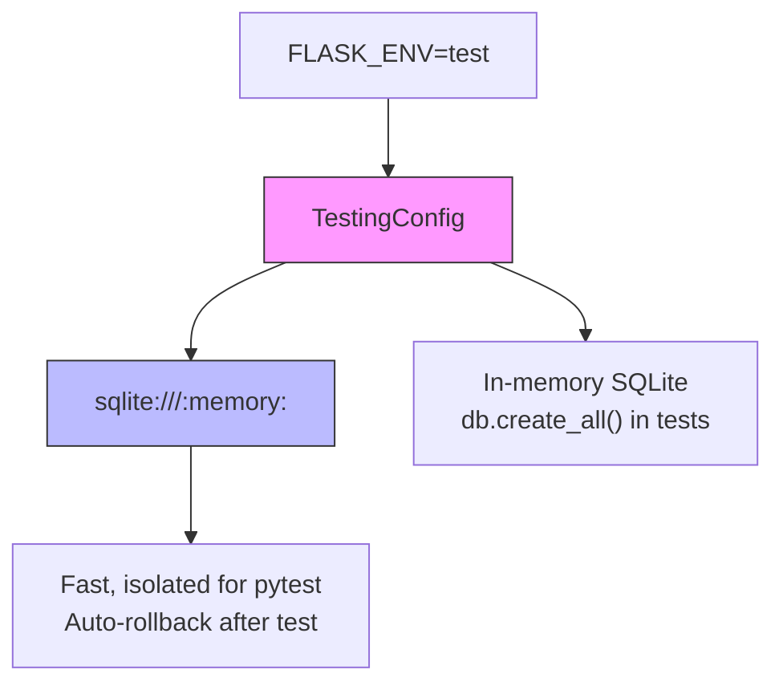
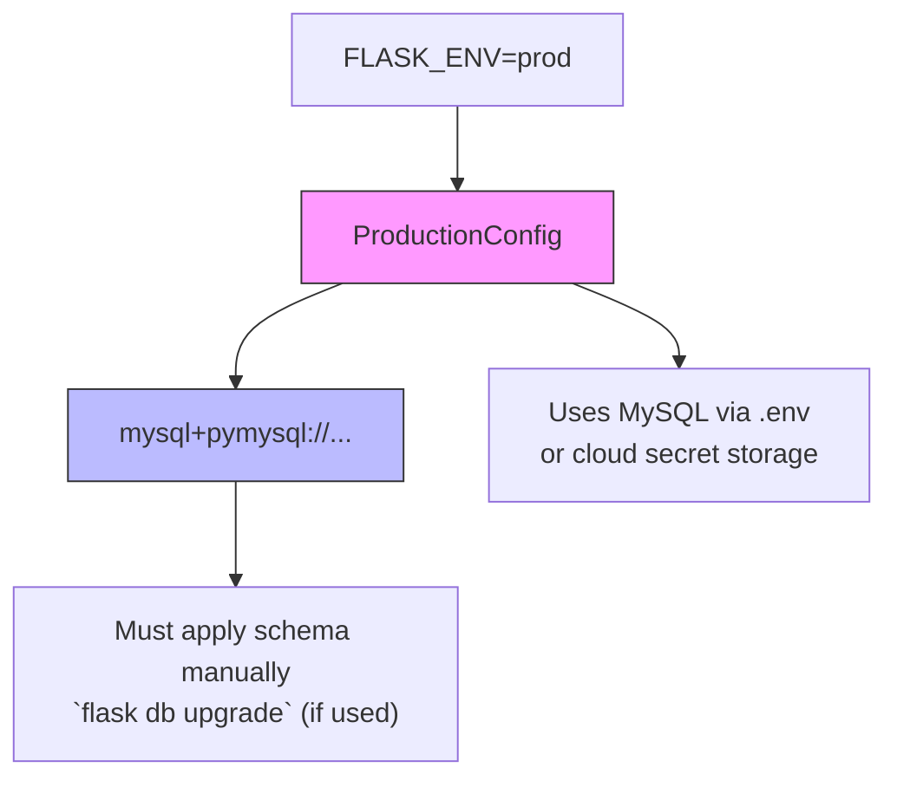

# Smart Grocery App Database Management
1. Development  
`FLASK_ENV=development flask run`

2. Testing (Pytest will use TestingConfig)  
`pytest`

3. Production (e.g., via gunicorn)  
`FLASK_ENV=production gunicorn run:app`

## Development

The development database is set to be created in `./instance/dev.db` using `SQLAlchemy`.

The command `db.create_all()` is used to create the temporary database as defined by in `models.py`.

## Testing

TBD

## Production
The production database will us mySQL.  
The schema is defined in `smart_grocery_schema.sql`

### Local Testing
`mysql -u your_user -p your_database < smart_grocery_schema.sql
`

### Deployment
TBD